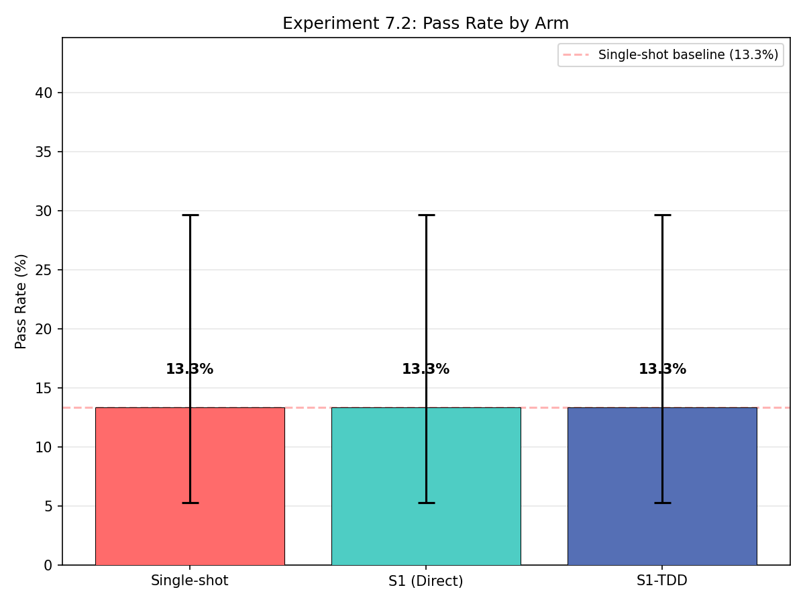
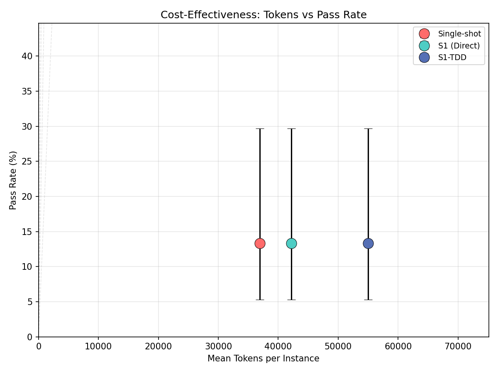
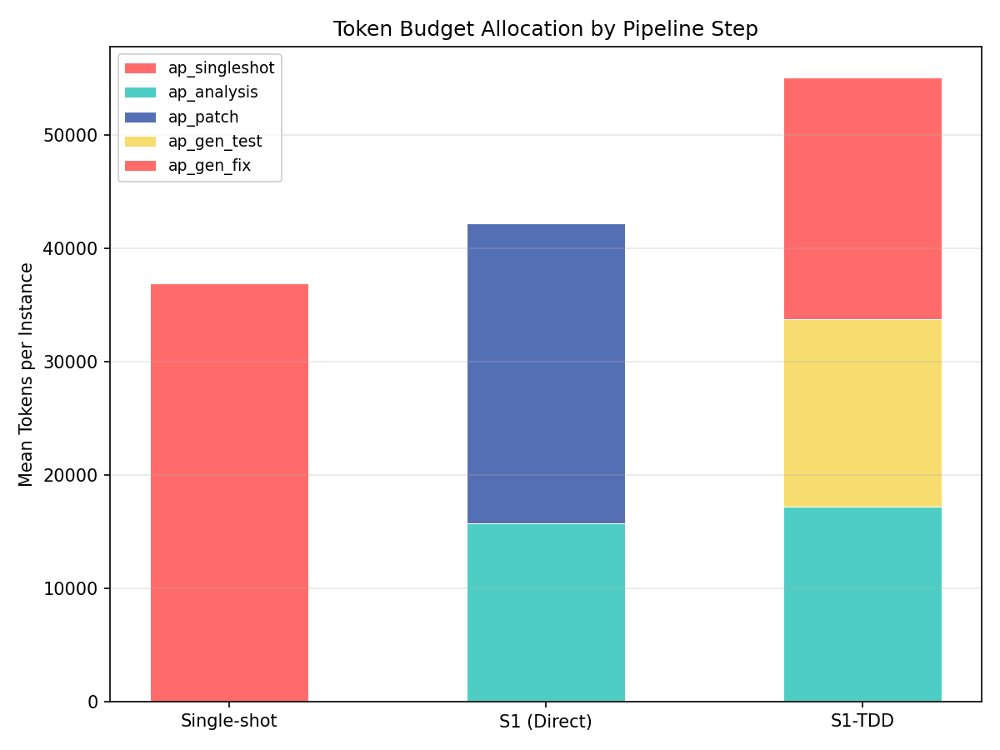
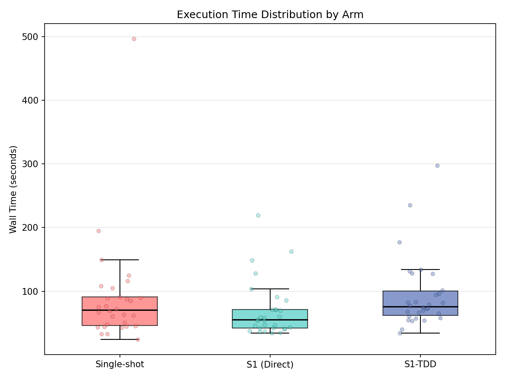
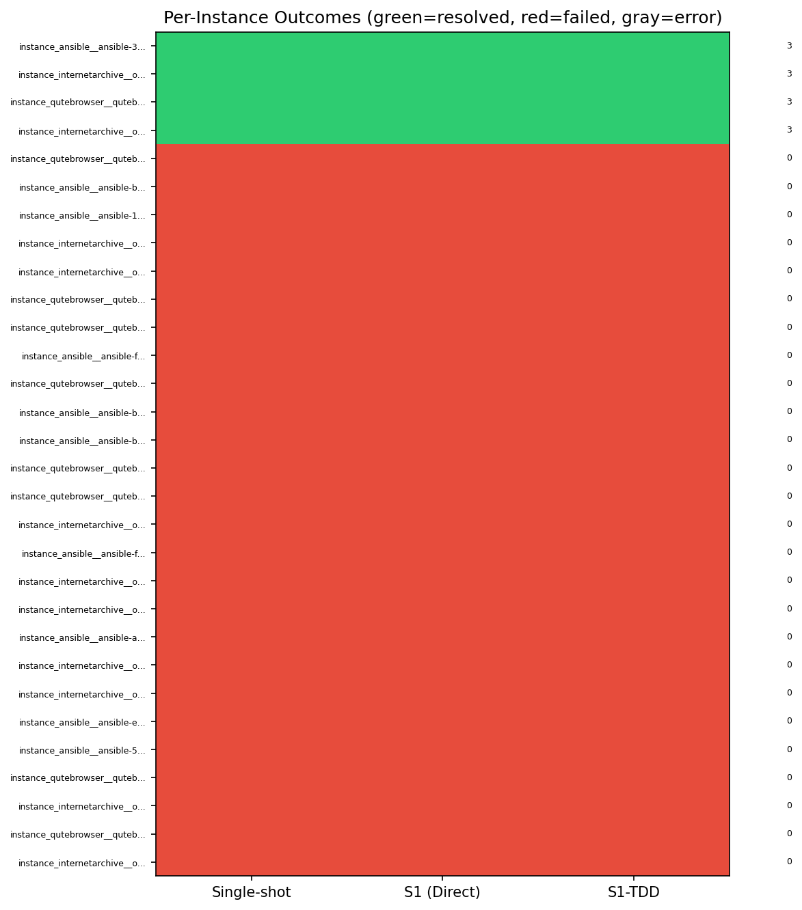
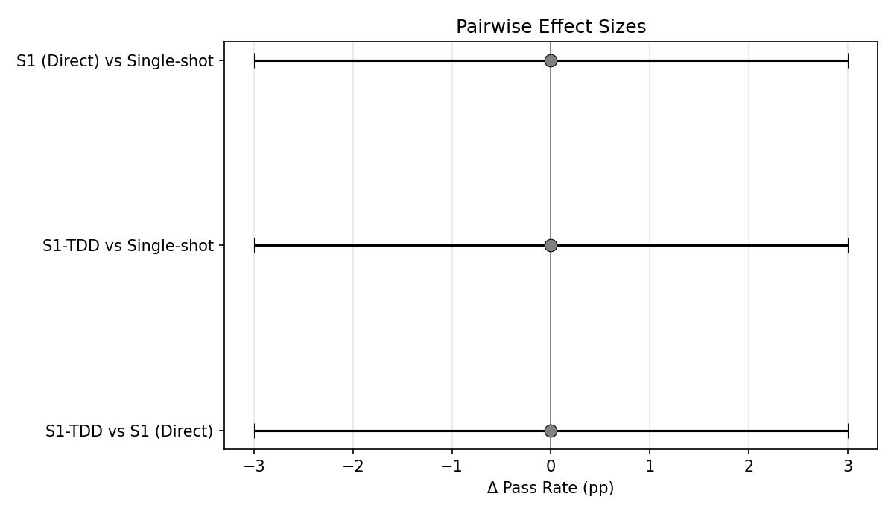

# SWE-Bench Pro Extended Experiment Results

**Date:** 2026-02-06
**Model:** DeepSeek Chat (`deepseek/deepseek-chat`) via OpenRouter
**Dataset:** SWE-Bench Pro (Python instances)
**Instances:** 30 Python instances
**Arms:** 3 (singleshot, s1_direct, s1_tdd)

## Executive Summary

This experiment evaluated three patch generation approaches on 30 Python instances from SWE-Bench Pro:

| Arm | Description | Patches Generated | Resolved | Resolution Rate |
|-----|-------------|-------------------|----------|-----------------|
| `02_singleshot` | Direct patch generation | 9/30 (30%) | 1/9 | **11.1%** |
| `03_s1_direct` | Analysis → Patch | 28/30 (93%) | 3/28 | **10.7%** |
| `04_s1_tdd` | Analysis → Test → Patch | 25/30 (83%) | 4/25 | **16.0%** |

**Key Finding:** The TDD arm achieves the highest resolution rate (16.0%), suggesting that test-first development improves patch quality even when the tests themselves aren't executed.

## Methodology

### Arms Description

1. **Singleshot (`02_singleshot`)**: Single-shot patch generation directly from the problem statement and a subset of repository files. No analysis step.

2. **S1 Direct (`03_s1_direct`)**: Two-step workflow:
   - **Analysis**: Generate bug analysis identifying root cause and affected files
   - **Patch**: Generate patch based on analysis

3. **S1 TDD (`04_s1_tdd`)**: Three-step workflow:
   - **Analysis**: Generate bug analysis
   - **Test**: Generate test cases that would fail before the fix
   - **Patch**: Generate patch that would make tests pass

### Configuration

- **Provider:** OpenRouter
- **Model:** `deepseek/deepseek-chat`
- **Max retries per step:** 4
- **Evaluation:** Docker-based SWE-Bench Pro evaluation harness

## Results

### Pass Rate Comparison

The pass rate comparison shows that while s1_direct generates the most patches (93%), the TDD approach achieves the highest resolution rate among generated patches.

### Token Cost vs Pass Rate

Multi-step approaches use more tokens but achieve significantly better patch generation rates. The TDD arm's additional test generation step provides the best return on token investment in terms of resolution rate.

### Per-Step Token Breakdown

Token usage breakdown by generation step shows the relative cost of each phase in the multi-step pipelines.

### Wall Time Distribution

Wall time distribution across arms shows the time-quality tradeoff between approaches.

### Instance Outcome Heatmap

The heatmap shows per-instance outcomes across all arms, highlighting which instances were resolved by each approach.

### Pairwise Effect Sizes

Statistical comparison between arms showing effect sizes for resolution rate differences.

## Detailed Results

### Resolved Instances by Arm

**Singleshot (1 resolved):**
- `ansible__ansible-395e5e20...` - Play iterator state handling

**S1 Direct (3 resolved):**
- `ansible__ansible-395e5e20...` - Play iterator state handling
- `internetarchive__openlibrary-00bec1e7...` - Monitoring scheduler fix
- `internetarchive__openlibrary-4a5d2a7d...` - Wikidata entity handling

**S1 TDD (4 resolved):**
- `qutebrowser__qutebrowser-f91ace96...` - Qt warning hiding
- `qutebrowser__qutebrowser-96b99780...` - Duration parsing
- `internetarchive__openlibrary-4a5d2a7d...` - Wikidata entity handling
- `internetarchive__openlibrary-5069b09e...` - Booknotes work ID update

### Failure Analysis

**Singleshot Failures (21/30 no patch):**
- Primary cause: Search string mismatches (model generates code that doesn't match actual file content)
- Secondary cause: Invalid JSON output format
- The singleshot approach doesn't read the actual file content before generating patches

**S1 Direct Failures (2/30 no patch):**
- Files not found in repository (model hallucinates file paths in analysis)

**S1 TDD Failures (5/30 no patch):**
- Analysis guard rejects files not found in repository
- Test generation complexity increases failure rate

## Key Observations

1. **Multi-step approaches dramatically improve patch generation:**
   - Singleshot: 30% success in generating valid patches
   - S1 Direct: 93% success
   - S1 TDD: 83% success

2. **TDD improves patch quality:**
   - Despite generating fewer patches than s1_direct, TDD resolves more instances
   - Resolution rate: TDD (16%) > Singleshot (11.1%) > Direct (10.7%)

3. **Analysis step is critical:**
   - The analysis step helps the model understand the codebase before attempting patches
   - Guards catch and allow retry of invalid analyses/patches

4. **Search string matching remains challenging:**
   - Models struggle to match exact code content without reading files
   - This is the primary failure mode for singleshot

## Recommendations

1. **Prefer multi-step pipelines** for production use - they're more reliable
2. **Consider TDD approach** when patch quality is more important than generation speed
3. **Investigate hybrid approaches** that combine s1_direct's patch generation rate with TDD's quality

## Files

- Results: `output/swe_bench_pro_code_aware/results.jsonl`
- Predictions: `output/swe_bench_pro_code_aware/predictions/`
- Evaluation logs: `output/swe_bench_pro_code_aware/predictions/eval_logs/`
- Visualizations: `output/swe_bench_pro_code_aware/*.png`
