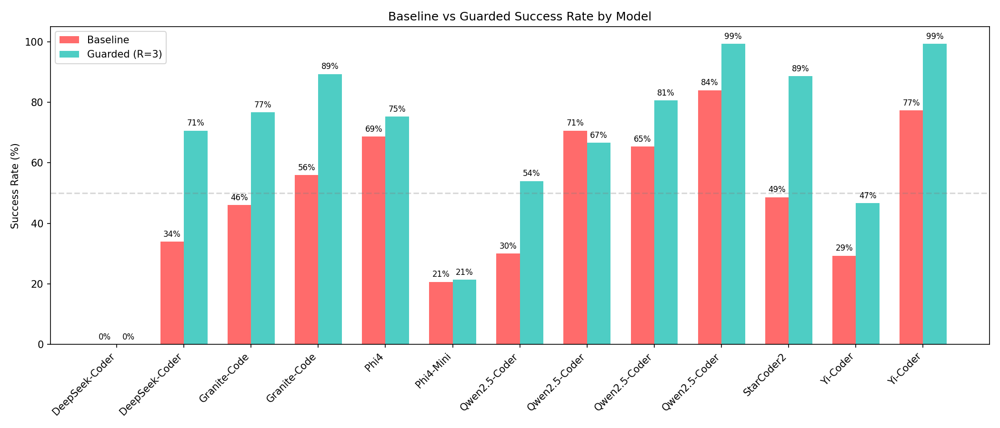
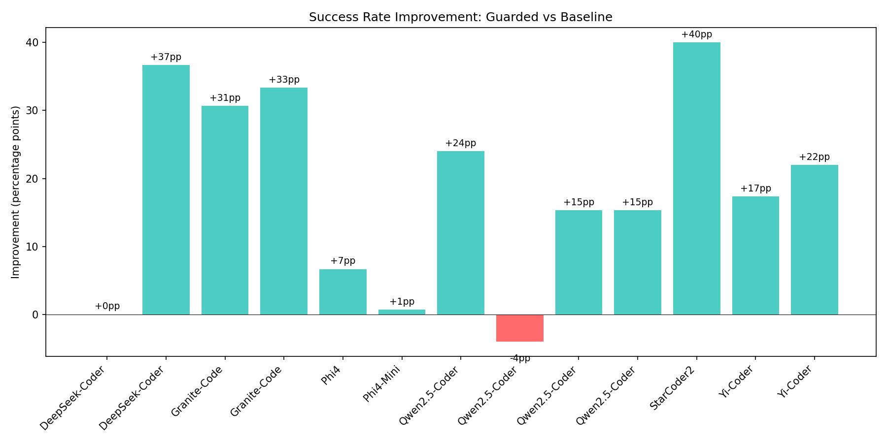
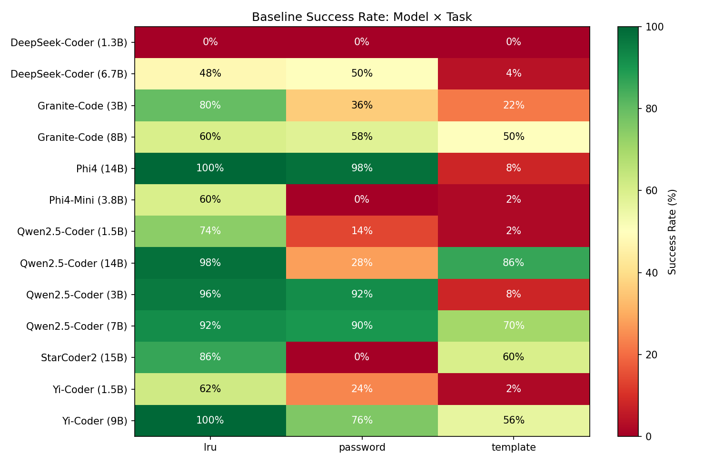
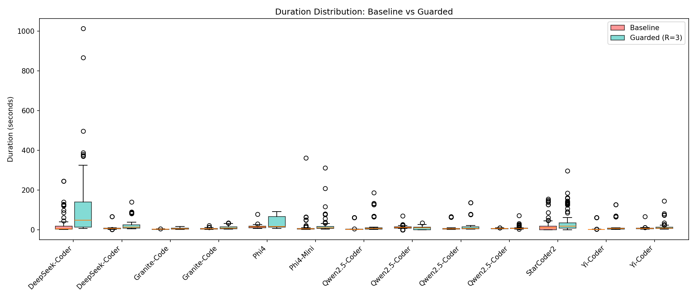
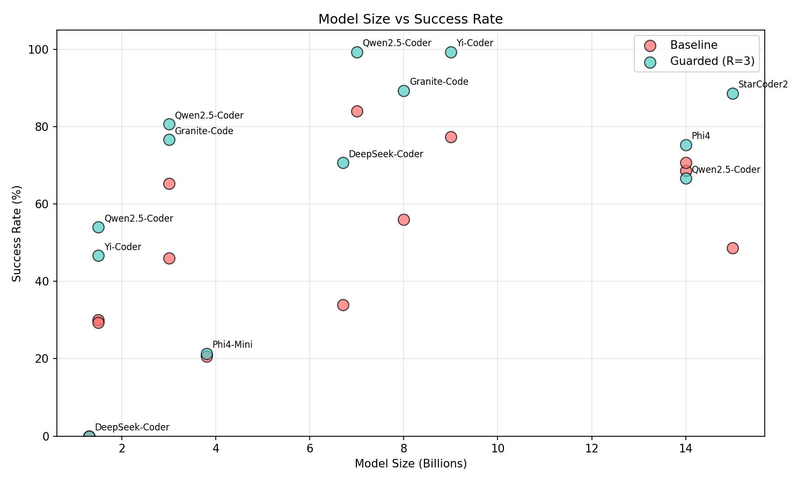
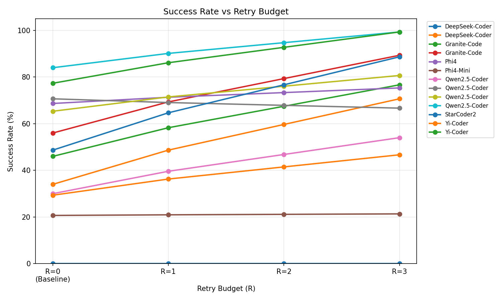

# Dual-State Agent Simulation Report

*Generated: 2025-12-17 14:39:36*

*Data source: results/overnight_20251216.db*

*Total trials: 3900*

## Executive Summary

| Metric | Value |
|--------|-------|
| Average Baseline Success | 48.5% |
| Average Guarded Success | 66.8% |
| **Overall Improvement** | **+18.3pp** |

## Visualizations

### Baseline vs Guarded Success Rate

### Improvement by Model

### Model × Task Heatmaps

| Baseline | Guarded |
|----------|---------|
|  |  |

### Duration Distribution

### Model Size vs Success

### Retry Impact

## Statistical Analysis

*Significance: \*\*\* p<0.001, \*\* p<0.01, \* p<0.05*

### LRU Task

| Model | Baseline | Guarded | Δ | 95% CI (Base) | 95% CI (Guard) | p-value | Effect Size |
|-------|----------|---------|---|---------------|----------------|---------|-------------|
| DeepSeek-Coder (1.3B) | 0% | 0% | +0pp | [0-7%] | [0-7%] | 1.0000 | 0.00 (negligible) |
| DeepSeek-Coder (6.7B) | 48% | 98% | +50pp | [35-61%] | [90-100%] | 0.0000*** | 1.33 (large) |
| Granite-Code (3B) | 80% | 98% | +18pp | [67-89%] | [90-100%] | 0.0078** | 0.64 (medium) |
| Granite-Code (8B) | 60% | 98% | +38pp | [46-72%] | [90-100%] | 0.0000*** | 1.09 (large) |
| Phi4 (14B) | 100% | 100% | +0pp | [93-100%] | [93-100%] | 1.0000 | 0.00 (negligible) |
| Phi4-Mini (3.8B) | 60% | 58% | +-2pp | [46-72%] | [44-71%] | 1.0000 | 0.04 (negligible) |
| Qwen2.5-Coder (1.5B) | 74% | 98% | +24pp | [60-84%] | [90-100%] | 0.0008*** | 0.79 (medium) |
| Qwen2.5-Coder (14B) | 98% | 100% | +2pp | [90-100%] | [93-100%] | 1.0000 | 0.28 (small) |
| Qwen2.5-Coder (3B) | 96% | 100% | +4pp | [87-99%] | [93-100%] | 0.4949 | 0.40 (small) |
| Qwen2.5-Coder (7B) | 92% | 100% | +8pp | [81-97%] | [93-100%] | 0.1175 | 0.57 (medium) |
| StarCoder2 (15B) | 86% | 100% | +14pp | [74-93%] | [93-100%] | 0.0125* | 0.77 (medium) |
| Yi-Coder (1.5B) | 62% | 98% | +36pp | [48-74%] | [90-100%] | 0.0000*** | 1.04 (large) |
| Yi-Coder (9B) | 100% | 100% | +0pp | [93-100%] | [93-100%] | 1.0000 | 0.00 (negligible) |

### PASSWORD Task

| Model | Baseline | Guarded | Δ | 95% CI (Base) | 95% CI (Guard) | p-value | Effect Size |
|-------|----------|---------|---|---------------|----------------|---------|-------------|
| DeepSeek-Coder (1.3B) | 0% | 0% | +0pp | [0-7%] | [0-7%] | 1.0000 | 0.00 (negligible) |
| DeepSeek-Coder (6.7B) | 50% | 96% | +46pp | [37-63%] | [87-99%] | 0.0000*** | 1.17 (large) |
| Granite-Code (3B) | 36% | 80% | +44pp | [24-50%] | [67-89%] | 0.0000*** | 0.93 (large) |
| Granite-Code (8B) | 58% | 94% | +36pp | [44-71%] | [84-98%] | 0.0000*** | 0.92 (large) |
| Phi4 (14B) | 98% | 100% | +2pp | [90-100%] | [93-100%] | 1.0000 | 0.28 (small) |
| Phi4-Mini (3.8B) | 0% | 0% | +0pp | [0-7%] | [0-7%] | 1.0000 | 0.00 (negligible) |
| Qwen2.5-Coder (1.5B) | 14% | 52% | +38pp | [7-26%] | [39-65%] | 0.0001*** | 0.84 (large) |
| Qwen2.5-Coder (14B) | 28% | 0% | +-28pp | [17-42%] | [0-7%] | 0.0000*** | 1.12 (large) |
| Qwen2.5-Coder (3B) | 92% | 100% | +8pp | [81-97%] | [93-100%] | 0.1175 | 0.57 (medium) |
| Qwen2.5-Coder (7B) | 90% | 100% | +10pp | [79-96%] | [93-100%] | 0.0563 | 0.64 (medium) |
| StarCoder2 (15B) | 0% | 66% | +66pp | [0-7%] | [52-78%] | 0.0000*** | 1.90 (large) |
| Yi-Coder (1.5B) | 24% | 36% | +12pp | [14-37%] | [24-50%] | 0.2752 | 0.26 (small) |
| Yi-Coder (9B) | 76% | 100% | +24pp | [63-86%] | [93-100%] | 0.0002*** | 1.02 (large) |

### TEMPLATE Task

| Model | Baseline | Guarded | Δ | 95% CI (Base) | 95% CI (Guard) | p-value | Effect Size |
|-------|----------|---------|---|---------------|----------------|---------|-------------|
| DeepSeek-Coder (1.3B) | 0% | 0% | +0pp | [0-7%] | [0-7%] | 1.0000 | 0.00 (negligible) |
| DeepSeek-Coder (6.7B) | 4% | 18% | +14pp | [1-13%] | [10-31%] | 0.0511 | 0.47 (small) |
| Granite-Code (3B) | 22% | 52% | +30pp | [13-35%] | [39-65%] | 0.0035** | 0.63 (medium) |
| Granite-Code (8B) | 50% | 76% | +26pp | [37-63%] | [63-86%] | 0.0124* | 0.55 (medium) |
| Phi4 (14B) | 8% | 26% | +18pp | [3-19%] | [16-40%] | 0.0310* | 0.50 (small) |
| Phi4-Mini (3.8B) | 2% | 6% | +4pp | [0-10%] | [2-16%] | 0.6173 | 0.21 (small) |
| Qwen2.5-Coder (1.5B) | 2% | 12% | +10pp | [0-10%] | [6-24%] | 0.1117 | 0.42 (small) |
| Qwen2.5-Coder (14B) | 86% | 100% | +14pp | [74-93%] | [93-100%] | 0.0125* | 0.77 (medium) |
| Qwen2.5-Coder (3B) | 8% | 42% | +34pp | [3-19%] | [29-56%] | 0.0001*** | 0.84 (large) |
| Qwen2.5-Coder (7B) | 70% | 98% | +28pp | [56-81%] | [90-100%] | 0.0002*** | 0.88 (large) |
| StarCoder2 (15B) | 60% | 100% | +40pp | [46-72%] | [93-100%] | 0.0000*** | 1.37 (large) |
| Yi-Coder (1.5B) | 2% | 6% | +4pp | [0-10%] | [2-16%] | 0.6173 | 0.21 (small) |
| Yi-Coder (9B) | 56% | 98% | +42pp | [42-69%] | [90-100%] | 0.0000*** | 1.17 (large) |

## Retry Distribution

*Percentage of trials succeeding at each retry level (Guarded config)*

### LRU

| Model | R=0 | R=1 | R=2 | R=3 | Avg Retries |
|-------|-----|-----|-----|-----|-------------|
| DeepSeek-Coder (1.3B) | 0% | 0% | 0% | 6% | 3.94 |
| DeepSeek-Coder (6.7B) | 46% | 40% | 6% | 8% | 0.76 |
| Granite-Code (3B) | 70% | 26% | 2% | 0% | 0.38 |
| Granite-Code (8B) | 64% | 26% | 4% | 6% | 0.52 |
| Phi4 (14B) | 98% | 2% | 0% | 0% | 0.02 |
| Phi4-Mini (3.8B) | 36% | 14% | 12% | 10% | 1.80 |
| Qwen2.5-Coder (1.5B) | 86% | 10% | 2% | 0% | 0.22 |
| Qwen2.5-Coder (14B) | 100% | 0% | 0% | 0% | 0.00 |
| Qwen2.5-Coder (3B) | 86% | 10% | 4% | 0% | 0.18 |
| Qwen2.5-Coder (7B) | 94% | 6% | 0% | 0% | 0.06 |
| StarCoder2 (15B) | 92% | 6% | 2% | 0% | 0.10 |
| Yi-Coder (1.5B) | 56% | 22% | 14% | 6% | 0.76 |
| Yi-Coder (9B) | 96% | 4% | 0% | 0% | 0.04 |

### PASSWORD

| Model | R=0 | R=1 | R=2 | R=3 | Avg Retries |
|-------|-----|-----|-----|-----|-------------|
| DeepSeek-Coder (1.3B) | 0% | 0% | 0% | 8% | 3.92 |
| DeepSeek-Coder (6.7B) | 64% | 12% | 12% | 12% | 0.72 |
| Granite-Code (3B) | 28% | 22% | 30% | 16% | 1.46 |
| Granite-Code (8B) | 42% | 32% | 18% | 8% | 0.92 |
| Phi4 (14B) | 94% | 6% | 0% | 0% | 0.06 |
| Phi4-Mini (3.8B) | 0% | 48% | 14% | 10% | 2.18 |
| Qwen2.5-Coder (1.5B) | 26% | 12% | 22% | 28% | 1.88 |
| Qwen2.5-Coder (14B) | 0% | 100% | 0% | 0% | 1.00 |
| Qwen2.5-Coder (3B) | 82% | 8% | 10% | 0% | 0.28 |
| Qwen2.5-Coder (7B) | 74% | 20% | 6% | 0% | 0.32 |
| StarCoder2 (15B) | 42% | 40% | 12% | 4% | 0.84 |
| Yi-Coder (1.5B) | 10% | 12% | 20% | 30% | 2.54 |
| Yi-Coder (9B) | 72% | 20% | 6% | 2% | 0.38 |

### TEMPLATE

| Model | R=0 | R=1 | R=2 | R=3 | Avg Retries |
|-------|-----|-----|-----|-----|-------------|
| DeepSeek-Coder (1.3B) | 0% | 0% | 0% | 6% | 3.94 |
| DeepSeek-Coder (6.7B) | 6% | 4% | 10% | 34% | 3.10 |
| Granite-Code (3B) | 26% | 10% | 14% | 34% | 2.04 |
| Granite-Code (8B) | 44% | 8% | 14% | 26% | 1.46 |
| Phi4 (14B) | 4% | 18% | 32% | 40% | 2.26 |
| Phi4-Mini (3.8B) | 2% | 0% | 2% | 6% | 3.82 |
| Qwen2.5-Coder (1.5B) | 2% | 4% | 8% | 20% | 3.44 |
| Qwen2.5-Coder (14B) | 84% | 14% | 0% | 2% | 0.20 |
| Qwen2.5-Coder (3B) | 12% | 8% | 14% | 28% | 2.72 |
| Qwen2.5-Coder (7B) | 70% | 24% | 4% | 2% | 0.38 |
| StarCoder2 (15B) | 74% | 20% | 6% | 0% | 0.32 |
| Yi-Coder (1.5B) | 4% | 0% | 2% | 22% | 3.58 |
| Yi-Coder (9B) | 42% | 34% | 14% | 10% | 0.92 |

## Cost-Benefit Analysis

| Model | Task | Δ Success | Avg Cost | Gain/Cost |
|-------|------|-----------|----------|-----------|
| DeepSeek-Coder (1.3B) | lru | +0.0pp | 4.94x | +0.0pp/x |
| DeepSeek-Coder (6.7B) | lru | +50.0pp | 1.76x | +28.4pp/x |
| Granite-Code (3B) | lru | +18.0pp | 1.38x | +13.0pp/x |
| Granite-Code (8B) | lru | +38.0pp | 1.52x | +25.0pp/x |
| Phi4 (14B) | lru | +0.0pp | 1.02x | +0.0pp/x |
| Phi4-Mini (3.8B) | lru | +-2.0pp | 2.80x | +-0.7pp/x |
| Qwen2.5-Coder (1.5B) | lru | +24.0pp | 1.22x | +19.7pp/x |
| Qwen2.5-Coder (14B) | lru | +2.0pp | 1.00x | +2.0pp/x |
| Qwen2.5-Coder (3B) | lru | +4.0pp | 1.18x | +3.4pp/x |
| Qwen2.5-Coder (7B) | lru | +8.0pp | 1.06x | +7.5pp/x |
| StarCoder2 (15B) | lru | +14.0pp | 1.10x | +12.7pp/x |
| Yi-Coder (1.5B) | lru | +36.0pp | 1.76x | +20.5pp/x |
| Yi-Coder (9B) | lru | +0.0pp | 1.04x | +0.0pp/x |
| DeepSeek-Coder (1.3B) | password | +0.0pp | 4.92x | +0.0pp/x |
| DeepSeek-Coder (6.7B) | password | +46.0pp | 1.72x | +26.7pp/x |
| Granite-Code (3B) | password | +44.0pp | 2.46x | +17.9pp/x |
| Granite-Code (8B) | password | +36.0pp | 1.92x | +18.8pp/x |
| Phi4 (14B) | password | +2.0pp | 1.06x | +1.9pp/x |
| Phi4-Mini (3.8B) | password | +0.0pp | 3.18x | +0.0pp/x |
| Qwen2.5-Coder (1.5B) | password | +38.0pp | 2.88x | +13.2pp/x |
| Qwen2.5-Coder (14B) | password | +-28.0pp | 2.00x | +-14.0pp/x |
| Qwen2.5-Coder (3B) | password | +8.0pp | 1.28x | +6.2pp/x |
| Qwen2.5-Coder (7B) | password | +10.0pp | 1.32x | +7.6pp/x |
| StarCoder2 (15B) | password | +66.0pp | 1.84x | +35.9pp/x |
| Yi-Coder (1.5B) | password | +12.0pp | 3.54x | +3.4pp/x |
| Yi-Coder (9B) | password | +24.0pp | 1.38x | +17.4pp/x |
| DeepSeek-Coder (1.3B) | template | +0.0pp | 4.94x | +0.0pp/x |
| DeepSeek-Coder (6.7B) | template | +14.0pp | 4.10x | +3.4pp/x |
| Granite-Code (3B) | template | +30.0pp | 3.04x | +9.9pp/x |
| Granite-Code (8B) | template | +26.0pp | 2.46x | +10.6pp/x |
| Phi4 (14B) | template | +18.0pp | 3.26x | +5.5pp/x |
| Phi4-Mini (3.8B) | template | +4.0pp | 4.82x | +0.8pp/x |
| Qwen2.5-Coder (1.5B) | template | +10.0pp | 4.44x | +2.3pp/x |
| Qwen2.5-Coder (14B) | template | +14.0pp | 1.20x | +11.7pp/x |
| Qwen2.5-Coder (3B) | template | +34.0pp | 3.72x | +9.1pp/x |
| Qwen2.5-Coder (7B) | template | +28.0pp | 1.38x | +20.3pp/x |
| StarCoder2 (15B) | template | +40.0pp | 1.32x | +30.3pp/x |
| Yi-Coder (1.5B) | template | +4.0pp | 4.58x | +0.9pp/x |
| Yi-Coder (9B) | template | +42.0pp | 1.92x | +21.9pp/x |

## Interpretation

### Key Findings

1. **Guard effectiveness varies by task complexity** - Tasks with lower baseline success show larger improvements

2. **Diminishing returns at high baseline** - When baseline >90%, guards add minimal value

3. **Cost scales with difficulty** - More retries needed for harder tasks, but gain/cost ratio remains positive

### Statistical Notes

- **95% CI**: Wilson score interval (appropriate for binomial proportions)

- **p-value**: Fisher's exact test (no normal approximation assumptions)

- **Cohen's h**: Effect size for proportions (<0.2 negligible, 0.2-0.5 small, 0.5-0.8 medium, >0.8 large)
